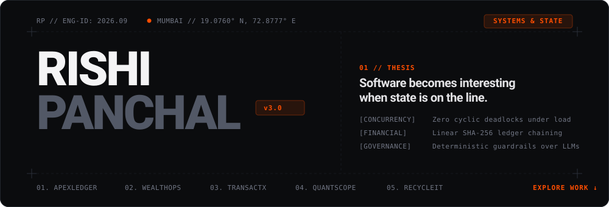
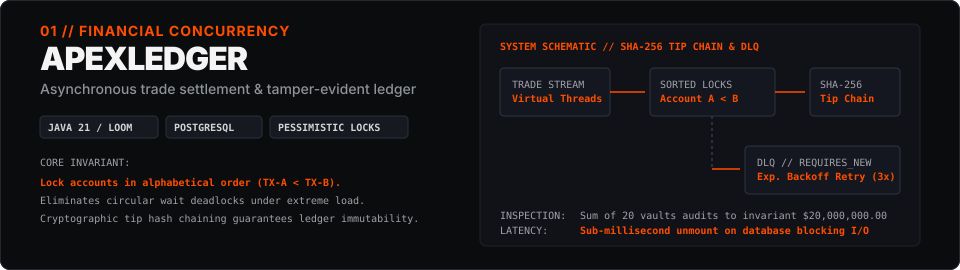
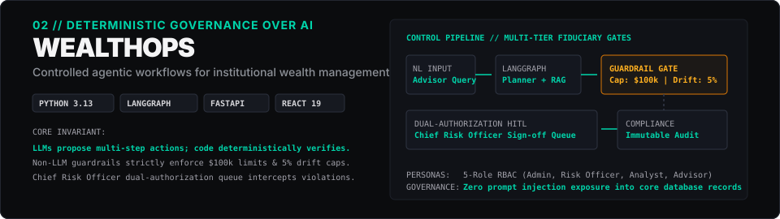
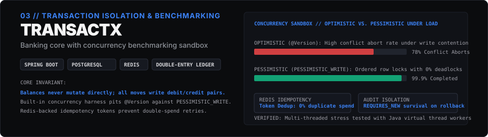
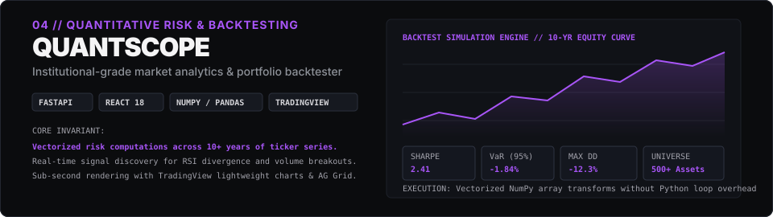
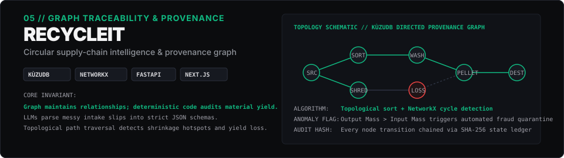
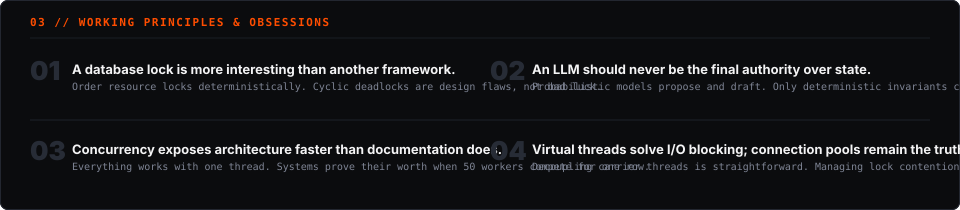
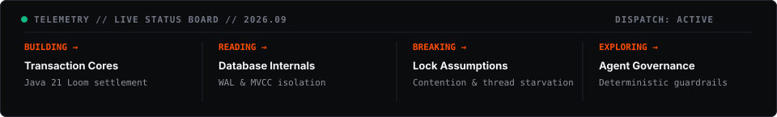
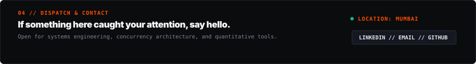

  

 

  

  <a href="https://github.com/rishibpanchal/ApexLedger"><code>EXPLORE APEXLEDGER ARCHITECTURE →</code></a>

 

  

  <a href="https://github.com/rishibpanchal/WealthOps"><code>EXPLORE WEALTHOPS GOVERNANCE →</code></a>

 

  

  <a href="https://github.com/rishibpanchal/TransactX"><code>EXPLORE TRANSACTX BENCHMARKS →</code></a>

 

  

  <a href="https://github.com/rishibpanchal/QuantScope"><code>EXPLORE QUANTSCOPE ENGINE →</code></a>

 

  

  <a href="https://github.com/rishibpanchal/RecycleIT"><code>EXPLORE RECYCLEIT GRAPH →</code></a>

 

  

 

  

 

  

 

  <a href="https://github.com/rishibpanchal"><code>[ GITHUB ]</code></a> &nbsp;&nbsp;&nbsp;&nbsp;
  <a href="https://linkedin.com/in/rishi-panchal"><code>[ LINKEDIN ]</code></a> &nbsp;&nbsp;&nbsp;&nbsp;
  <a href="mailto:rishibpanchal006@gmail.com"><code>[ EMAIL ]</code></a>

 
