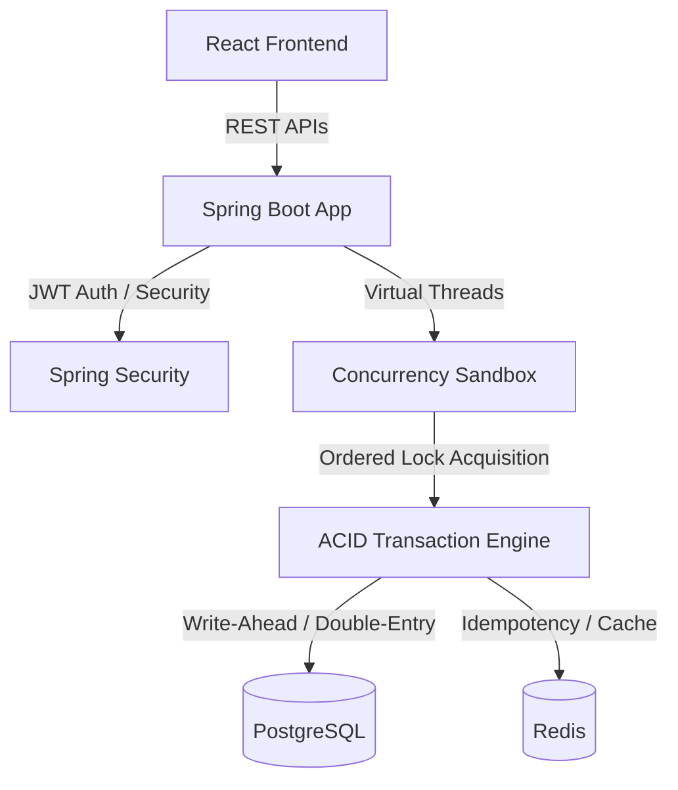
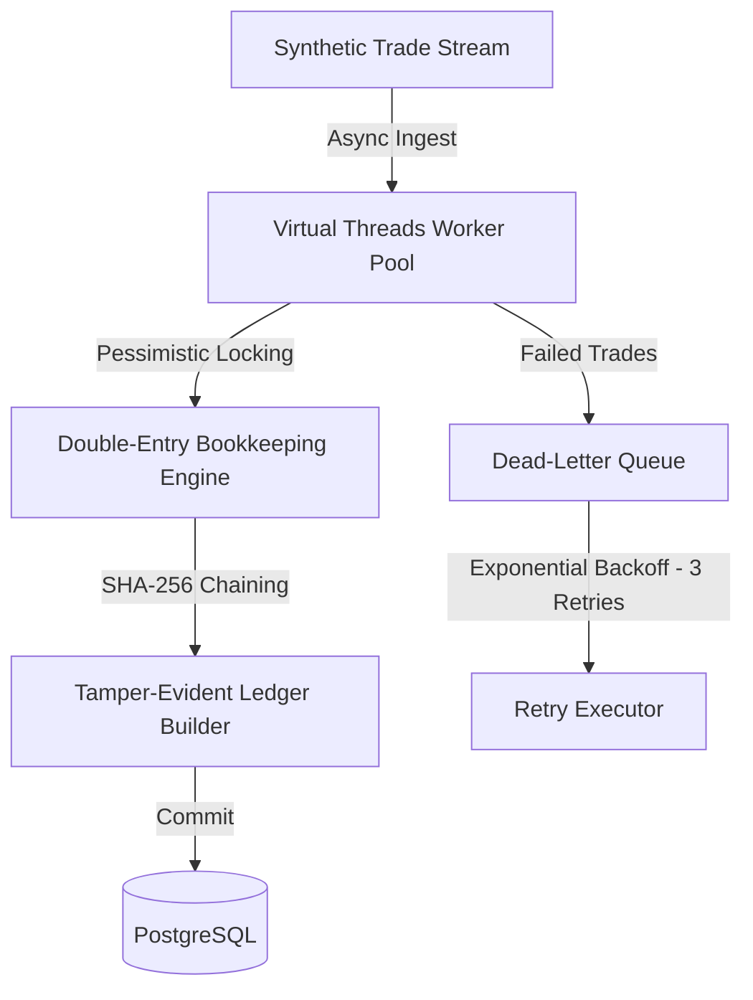
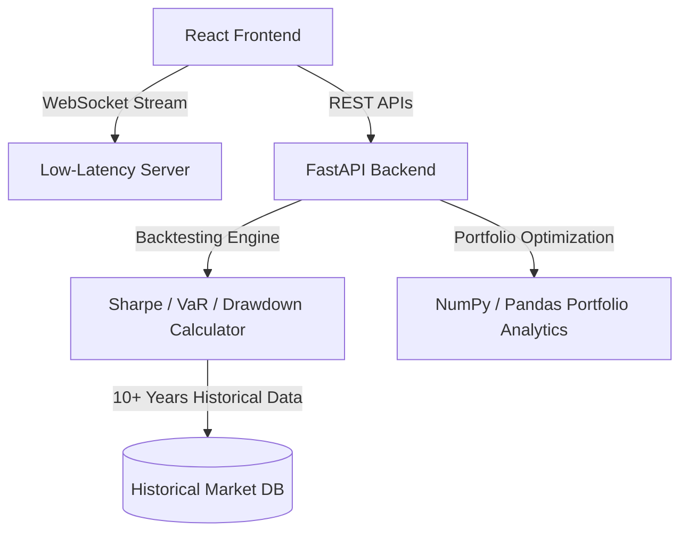
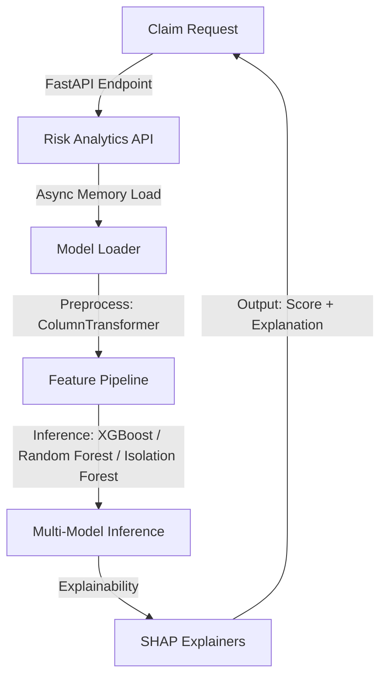
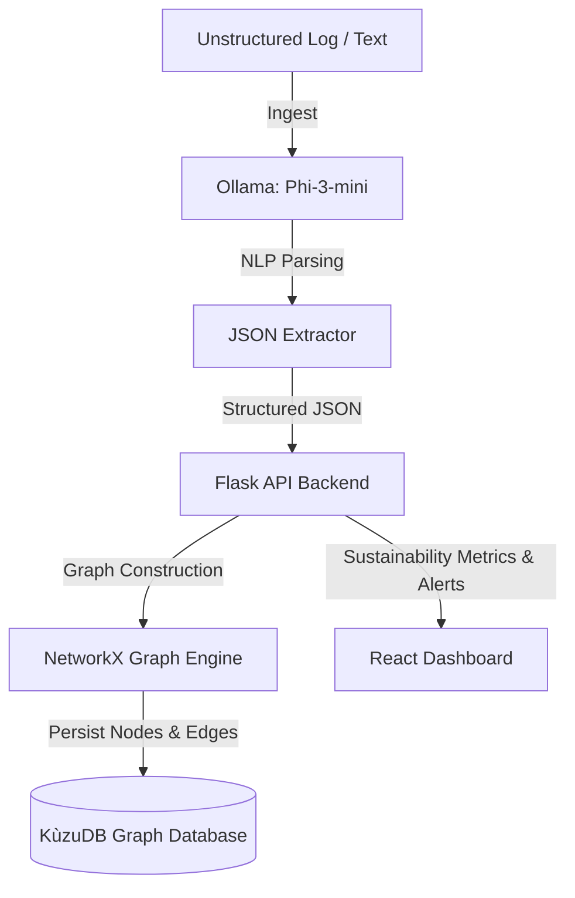

  

  

  
  
  

  
  
  

  

---

## 📌 About Me

I am a final-year Information Technology student at SVKM's Dwarkadas J Sanghvi College of Engineering. I am a curious engineer who enjoys building software products from scratch and solving real-world problems. 

My technical interests lie at the intersection of backend architecture, distributed systems, and artificial intelligence. I enjoy exploring how highly concurrent systems are designed, and I like combining AI with software engineering to build practical applications. Rather than just learning technologies in theory, I prefer to master them by designing, coding, and optimizing real projects.

### 🎯 Current Focus & Philosophy

- **Currently Building**: Secure transaction engines, backtesting architectures, and low-latency API wrappers.
- **Currently Learning**: High-throughput distributed transaction strategies, Java Virtual Threads optimization, and custom vector search indexing.
- **What Excites Me**: Reading about database internals, optimizing garbage collection for high-performance applications, and building tools that make unstructured data useful.
- **Engineering Interests**: Systems engineering, concurrency models, financial technology, and MLOps.
- **My Philosophy**: Code should be readable, tests should be exhaustive, and architectures should be built for reliability under load.

> *"Simplicity is the ultimate sophistication. Great software is built at the intersection of robust engineering and human-centric design."*

---

## 🛠️ Tech Stack

### 💻 Languages

  

### ⚙️ Backend Engineering & Frameworks

  

### 🎨 Frontend & GUI

  

### 🤖 Machine Learning & AI

  

### 🗄️ Databases & Caching

  

### 🔧 Developer Tools

  

**Core Frameworks & Tools:** `Spring Security` `PyQt6` `KùzuDB` `NetworkX` `Ollama (Phi-3-mini, Gemma)` `scikit-learn` `XGBoost` `SHAP` `REST APIs` `JWT Authentication` `Concurrent Programming` `Multithreading` `OOP`

---

## 🚀 Featured Projects

<b>1. TransactX — Secure Digital Banking System</b>

 

### Description
A secure digital banking system supporting deposits, withdrawals, fund transfers, account management, and transaction logging.

### Metrics & Architecture
| Dimension | Specification |
| :--- | :--- |
| **Stack** | Java, Spring Boot, PostgreSQL, Redis, React |
| **Scale** | Handles account operations through 10+ REST endpoints |
| **Performance** | Validated state consistency under 50+ concurrent requests |
| **Security** | ACID-compliant transaction engine with double-entry bookkeeping, idempotency, and ordered lock acquisition |
| **Impact** | Built a sandbox comparing locking performance using Java Virtual Threads |
| **Repository** | [TransactX](https://github.com/rishibpanchal/TransactX) |

### Architecture Diagram

### Engineering Details
- Engineered an ACID-compliant transaction engine using double-entry bookkeeping and ordered lock acquisition to guarantee transaction consistency under high concurrency.
- Designed a concurrency testing sandbox leveraging Java Virtual Threads to compare locking strategies.

<b>2. ApexLedger — High-Throughput Financial Settlement Engine</b>

 

### Description
An enterprise-grade financial settlement engine engineered to process transaction flows with minimal overhead.

### Metrics & Architecture
| Dimension | Specification |
| :--- | :--- |
| **Stack** | Java 21, Spring Boot, PostgreSQL |
| **Scale** | Asynchronously processes 10,000+ synthetic financial transactions per second |
| **Performance** | Sub-millisecond latency profile using Virtual Threads for async execution |
| **Security** | 100% elimination of cyclic deadlocks using pessimistic database locking; SHA-256 tamper-evident ledger chaining |
| **Impact** | Implemented a custom Dead-Letter Queue (DLQ) with up to 3 exponential backoff retries |
| **Repository** | [ApexLedger](https://github.com/rishibpanchal/ApexLedger) |

### Architecture Diagram

### Engineering Details
- Leveraged Java 21 Virtual Threads to asynchronously process 10,000+ synthetic financial transactions per second.
- Prevented race conditions and resolved deadlock hazards under heavy loads by implementing pessimistic locking on the database layer.
- Secured transaction history integrity with tamper-evident cryptographic chaining (SHA-256).

<b>3. QuantScope — Quantitative Research & Backtesting Platform</b>

 

### Description
A quantitative research terminal for real-time market analysis, signal discovery, and historical portfolio backtesting.

### Metrics & Architecture
| Dimension | Specification |
| :--- | :--- |
| **Stack** | React, FastAPI, Python (Pandas, NumPy) |
| **Scale** | Real-time market analysis and signal discovery across 500+ securities |
| **Performance** | Backtests historical market data representing 10+ years of activity |
| **Security** | Mathematical validation of metrics: Sharpe Ratio, VaR, drawdown, and correlation |
| **Impact** | Developed low-latency streaming infrastructure with WebSockets and intelligent caching |
| **Repository** | [QuantScope](https://github.com/rishibpanchal/QuantScope) |

### Architecture Diagram

### Engineering Details
- Engineered a low-latency market visualizer integrating WebSocket streaming and caching pipelines.
- Implemented a risk engine that calculates Sharpe Ratio, Value at Risk (VaR), drawdown, and correlation metrics across massive market histories.

<b>4. NextGen — Machine Learning Insurance Risk Engine</b>

 

### Description
A production-grade machine learning risk analytics pipeline designed to detect fraudulent insurance claims.

### Metrics & Architecture
| Dimension | Specification |
| :--- | :--- |
| **Stack** | FastAPI, Python (scikit-learn, XGBoost, Random Forest, Isolation Forest, SHAP) |
| **Scale** | Analyzes risk factors across 5,000+ claims |
| **Performance** | Accelerates model inference speed by 60% using asynchronous memory loading |
| **Security** | Isolated feature mappings (ColumnTransformer, TargetGuidedEncoder) to prevent data leakage |
| **Impact** | Boosts claim analyst productivity by 40% with explainable AI insights (SHAP) |
| **Repository** | [NextGen](https://github.com/rishibpanchal/NextGen) |

### Architecture Diagram

### Engineering Details
- Deployed a multi-model risk engine evaluating Random Forest, Isolation Forest, and XGBoost models.
- Resolved preprocessing data leakages during training/calibration using secure pipeline mappings.
- Integrated SHAP explainability arrays to output human-readable rationales for flagged anomalies.

<b>5. RecycleIT — Intelligent Traceability for Circular Economy</b>

 

### Description
A conversational NLP data ingestion pipeline and supply chain graph traceability system.

### Metrics & Architecture
| Dimension | Specification |
| :--- | :--- |
| **Stack** | Flask, React, KùzuDB, NetworkX, Ollama (Phi-3-mini) |
| **Scale** | Maps complex graph topologies of supply chains to identify loss hotspots |
| **Performance** | Accelerates raw data ingestion by 45% |
| **Security** | Conversational NLP parser extracting structured JSON from natural text |
| **Impact** | Reduces supply chain audit time by 40%; improves decision-making metrics by 35% |
| **Repository** | [RecycleIT](https://github.com/rishibpanchal/RecycleIT) |

### Architecture Diagram

### Engineering Details
- Designed an intelligent data parsing pipeline leveraging local LLMs (Phi-3-mini via Ollama) to convert unstructured operational records into clean JSON structure.
- Developed supply chain graph trace systems with NetworkX and KùzuDB to mapping dependencies.

---

## 💼 Professional Experience

### Software Developer Intern — **DataNorth Technologies Pvt. Ltd.**
**June 2025 — August 2025**

- **Problem Solved**: Manual data extraction and validation from complex business documents was highly inefficient and prone to analytical errors.
- **Tech Stack**: `Python` `pdfplumber` `Ollama (Gemma)` `PyQt6`
- **Engineering Contribution**:
  - Developed an automated Document AI pipeline using local LLMs (Gemma via Ollama) and `pdfplumber` to extract and structure unstructured data from complex business PDFs.
  - Built an asynchronous desktop interface using `PyQt6` to process large batches of documents concurrently.
  - Implemented robust verification schemas and exception handling layers to sanitize outputs.
- **Impact**:
  - Reduced manual processing effort for complex business documents by **90%+**.
  - Improved downstream data ingestion accuracy by **85%**.

---

## 👥 Leadership Experience

### Placement Coordinator — **SVKM's Dwarkadas J Sanghvi College of Engineering**
**August 2025 — Present**
- Managing data workflows, scheduling databases, and candidate tracking for a cohort of **1000+ students**.
- Coordinating corporate relationships, facilitating communications with recruiting teams, and streamlining the campus placement workflow.

### Creatives Head — **Computer Society of India (DJCSI)**
**August 2025 — June 2026**
- Led the creatives team in structuring digital branding, marketing strategies, and design campaigns for technical events and college hackathons.
- Headed promotional outreach to build branding elements for developer-centric workshops and hackathons.

---

## 🏆 Achievements

| Recognition | Awarding Organization / Event | Details |
| :--- | :--- | :--- |
| **2nd Prize Winner** | Nirmaan Project Showcase (DJ InIT.AI) | Awarded for outstanding project engineering and live prototype implementation. |
| **AI/ML Domain Winner** | Lines Of Code 8.0 Hackathon (DJSCE ACM) | Secured the domain championship for designing and deploying an optimized machine learning pipeline under a strict 24-hour deadline. |

---

## 📊 GitHub Analytics

  
  &nbsp;&nbsp;
  

  

  

  

  

---

## 🤝 Connect With Me

  
  &nbsp;&nbsp;
  
  &nbsp;&nbsp;
  

---

  

